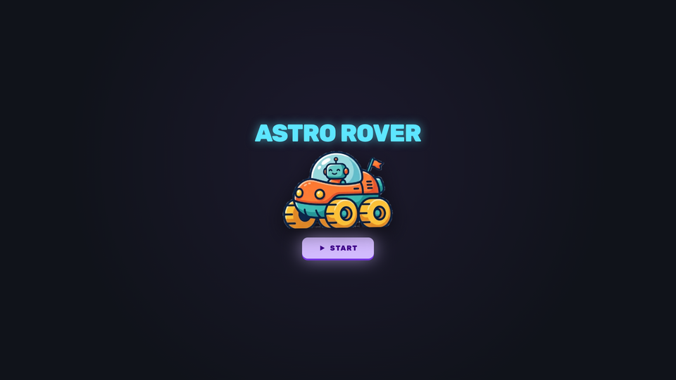
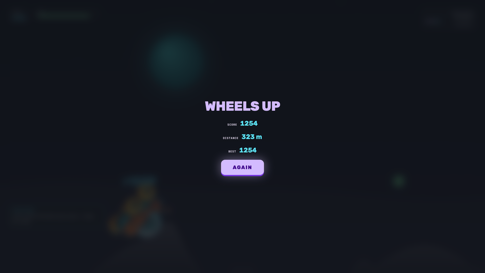

# Process overview

## What I built

A simple car game on different planets, small facts about the planet will also
keep showing up. The game has fuel points, fuel to collect and energy points. The
game keeps calculating distance as well.

## The moments that mattered

### 1 — the game brief

Gave the brief of the game and made Claude follow the files Stitch made to
understand the design. My brief said the planet should be picked at random each
time you press start. We did not: the first run is always the Moon, and only
later runs travel. A jump arc that changes before you have felt one reads as the
game being broken rather than as a different place, and nobody here is told
anything. I knew the shape held because the spec became tests *before* any game
code existed, so the build had a target instead of an opinion.

**Commits:**
[`198491b...a2787c3`](https://github.com/comp4020-agentic-coding-studio/comp4020-crit5-rithikanallaparaju16/compare/198491b...a2787c3)

### 2 — the flip that never ended the run

The code was using wrong reference to understand the flip of the car. So it fixed
that by changing the reference to which it understood what the "slope" was. The
obvious move was to patch the tilt number. Instead a failing test came first, one
that drops the rover from 40 m and asserts the run *ends* rather than asking the
rule a question I had already answered myself. It went red on the upside-down
cases and green on a normal landing, naming the bug before any physics changed.
Fixing it then made the game unwinnable by mashing, and the playability sensor
went red — correctly. That is how I knew the fix had landed: the sensor stayed
red until the pedals had enough authority in the air to save a bad launch, and
only then went green again.

**Commits:**
[`356f383`](https://github.com/comp4020-agentic-coding-studio/comp4020-crit5-rithikanallaparaju16/commit/356f383)

---

The verbatim prompt-by-prompt working notes these were curated from are in
[`docs/prompt-log.md`](docs/prompt-log.md).
